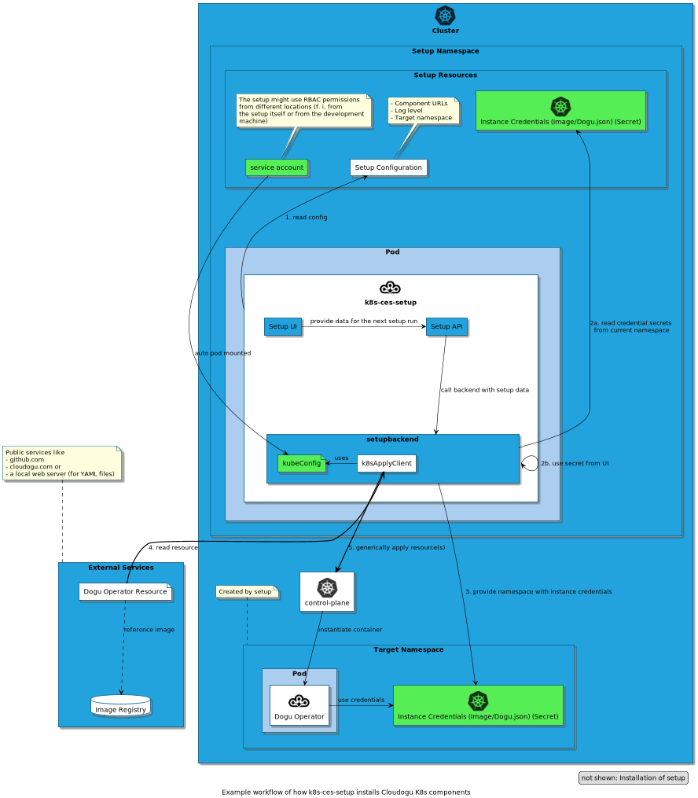

# Über die innere Architektur des Setups

Dieses Dokument beschreibt, den inneren Aufbau und die Funktionsweise von k8s-ces-setup. Dieses Dokument unterliegt voraussichtlich noch weiteren Bearbeitungen, da aktuell nur die Basisaktionen einer CES-Installation umgesetzt wurden. 

Hinweise zur Installation des Setups selbst liegen in der [Installationsanleitung](../operations/installation_guide_de.md) vor.

## Installationsablauf eines automatischen Setups

Das automatische Setup einer CES-Instanz ganz ohne weitere Benutzerinteraktion ("unattended setup") soll so ähnlich wie möglich zum herkömmlichen CES-Setup stattfinden.

**Voraussetzungen für ein unattended Setup:**
1. Dogu-Operator-Credentials wird als Secrets bereitgestellt
   * [Dogu-Registry credentials](https://github.com/cloudogu/k8s-dogu-operator/blob/develop/docs/operations/configuring_the_dogu_registry_de.md) 
   * [Image-Instanz credentials](https://github.com/cloudogu/k8s-dogu-operator/blob/develop/docs/operations/configuring_the_container_registry_de.md) 
2. Komponenten-Operator-Config wird bereitgestellt
   * [Helm-Repository-credentials](../operations/installation_guide_de.md#setup-ausbringen)
   * [Helm-Repository-config](../operations/installation_guide_de.md#setup-ausbringen)
3. [Setup-Konfiguration](../operations/configuration_guide_de.md) liegt in einer `ConfigMap` im gleichen Namespace, in dem das Setup läuft
4. [Setup-Deskriptor](../operations/custom_setup_configuration_de.md) `setup.json` liegt vor
5. Ein Clusteradministrator muss das Setup lauffähig deployen (siehe unten)

**Durchführung:**
Es erfolgt in mehreren Schritten, die die Abbildung oben gut veranschaulicht:

Vorbereitung (Deployment des Setups):
- A. Admin legt Zielnamespace an
- B. Admin legt konfiguriert Setup-Daten im `values.yaml` des Helm-Charts.
  - Instanz Credentials
  - Setup-Konfiguration
  - Komponenten-Versionen
- C. Admin deployt das Helm-Chart
- D. Admin löst die Setup-Ausführung an (siehe unten)

**Setup-Ausführung:**

1. Setup-Konfiguration einlesen
2. Cluster-Konfiguration einlesen
   - im Produktionsbetrieb wird diese durch das Setup-Deployment bereitgestellt
   - im Entwicklungsbetrieb kann diese auch von lokalen Kube-Configs ausgelesen werden
3. Dogu- und Image-Credentials auslesen
4. Komponenten-Operator im neuen Namespace installieren
5. Komponenten (dogu-operator, service-discovery, ...) als Komponenten-CRs in den neuen Namespace installieren
6. Dogus (gemäß `setup.json`) als Dogu-CRs in den neuen Namespace installieren

## Benötigte Berechtigungen zur Ausführung des Setups

Das Setup läuft grundsätzlich immer in dem Namespace, der für das zukünftige Cloudogu EcoSystem betriebsbereit gemacht werden soll.

Das Setup hängt bzgl. der nötigen Berechtigungen sehr stark von den zu installierenden Ressourcen ab, insbesondere dem Komponenten- und dem Dogu-Operator. Da dessen Ressourcen mit jeweiligen Releases schwanken können, benötigt der das Setup **alle Rechte auf den Zielnamespace (Role/RoleBinding)**.

Hinzu kommt, dass jedenfalls über den Dogu-Operator eine CustomResourceDefinition (CRD) installiert werden muss. CRDs gelten grundsätzlich clusterweit. Daher benötigt das Setup zusätzlich das Recht **zur Erzeugung/Aktualisierung von CRDs (ClusterRole/ClusterRoleBinding)**.

## (Unstructured) YAML-Ressourcen auf die K8s-API anwenden

Die Funktionalität hinter dem zentralen Struct `core.k8sApplyClient` basiert auf der Beschreibung von Ymmt2005[s Blogartikel](https://ymmt2005.hatenablog.com/entry/2020/04/14/An_example_of_using_dynamic_client_of_k8s.io/client-go#Mapping-between-GVK-and-GVR).

`core.k8sApplyClient` funktioniert ähnlich wie `kubectl` in dem es:
- K8s-Ressourcen in YAML-Form ausliest
- für die K8s-API verständlich transformiert
- und an die K8s-API

Die K8s-API verwendet REST-Calls auf Basis von JSON. YAML ist daher grundsätzlich nicht kompatibel und muss transformiert werden. Wegen der komplexen Natur von K8s-Ressourcen (viele unterschiedliche Ressourcen in teilweise vielen unterschiedlichen Versionen) ist eine manuelle Transformation in JSON oder mit sonst üblichen typisierten Mechanismen (`clientSet.CoreV1().Namespaces().Create(...)`) nicht machbar. Ebenso wenig lässt sich der Quellcode von `kubectl` sinnvoll wiederverwenden, da dessen innere Struktur so stark auf ein Kommandozeilentool ausgelegt wurde, dass der zentrale Kern der YAML-Transformation nicht sinnvoll übernommen werden kann.

Stattdessen wird ein dynamischer Mechanismus verwendet, der K8s-Ressourcen in `unstructured.Unstructured` einliest. Daraus wird die entsprechende REST-API ermitteln, die durch [Server Side Apply](https://kubernetes.io/docs/reference/using-api/api-concepts/#server-side-apply) dann auf den Cluster angewendet wird. Durch die Natur des `PATCH`-Verbs im REST-Call kann so eine noch nicht existierende Ressource angelegt oder eine bereits existierende Ressource aktualisiert werden.

**Die Schritte als Übersicht:**

1. Vorbereitung: REST-Mapper herstellen, um das GVR zu finden
2. Vorbereitung: Dynamic client herstellen
3. YAML nach `unstructured.Unstructured`-Objekt parsen
4. GVR durch GVK und REST-Mapper ermitteln
5. REST-Interface für das GVR ermitteln
6. Objekt nach JSON umwandeln
7. Ressource durch PATCH anlegen oder aktualisieren (deutet der API ein `Server Side Apply` an)
