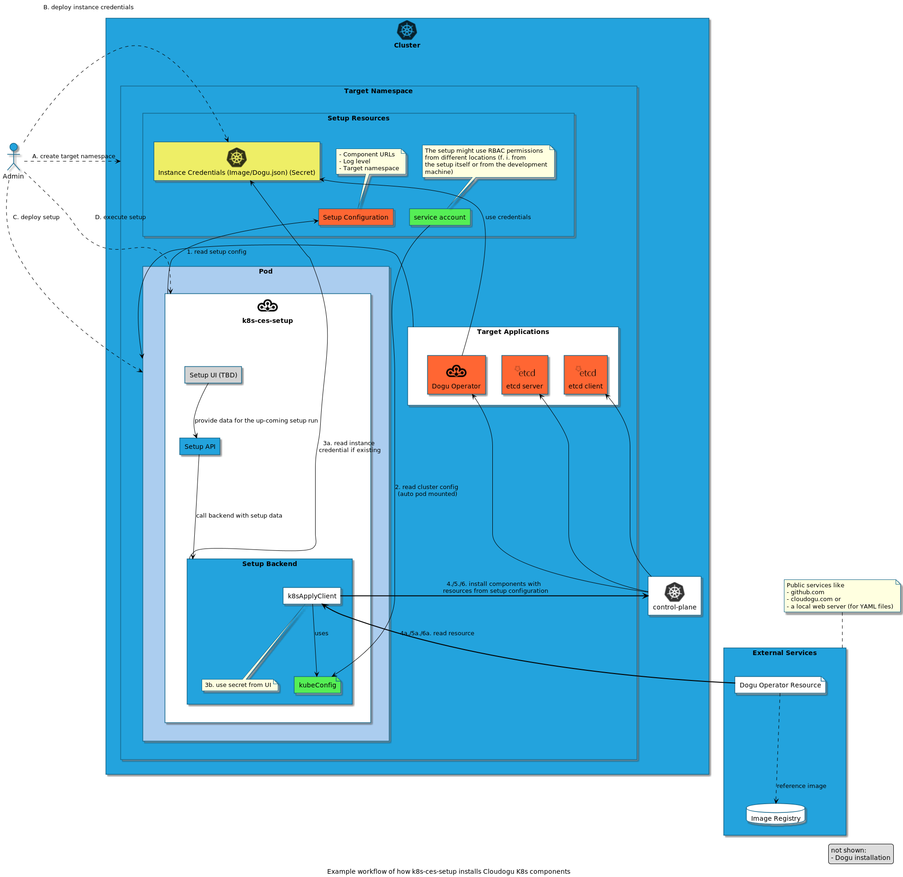

# About the inner architecture of the setup

This document describes the inner architecture and functionality of k8s-ces-setup. This document is likely to be subject to further editing, as currently only the basic actions of a CES installation have been implemented.

Instructions for the installation of the setup itself are available in the [installation guide](../operations/installation_guide_en.md).

## Installation procedure of an automatic setup

The automatic setup of a CES instance completely without further user interaction ("unattended setup") should take place as similar as possible to the conventional CES setup.

**Requirements for an unattended setup:**.
1. dogu operator credentials is provided as Secrets.
    * [Dogu registry credentials](https://github.com/cloudogu/k8s-dogu-operator/blob/develop/docs/operations/configuring_the_dogu_registry_en.md)
    * [Image-Instance credentials](https://github.com/cloudogu/k8s-dogu-operator/blob/develop/docs/operations/configuring_the_container_registry_en.md)
2. component-operator-config is provided.
    * [Helm-Repository-credentials](../operations/installation_guide_en.md#deploy-setup)
    * [helmet-repository-config](../operations/installation_guide_en.md#deploy-setup)
3. [setup-configuration](../operations/configuration_guide_en.md) is in a `ConfigMap` in the same namespace where the setup runs
4. [Setup descriptor](../operations/custom_setup_configuration_en.md) `setup.json` is present
5. a cluster administrator must deploy the setup executable (see below)

**Execution:**
It is done in several steps, which the figure above illustrates well:

Preparation (deployment of the setup):
- A. Admin creates target namespace
- B. Admin configures required setup data in `values.yaml` from the Helm-Chart
   - Instance credentials
   - Setup configuration
   - Component versions
- C. Admin deploys the setup
- D. Admin triggers the setup execution (see below)

**Setup execution:**

1. read setup configuration
2. read cluster configuration
   - in production mode this is provided by setup deployment
   - in development mode this can also be read from local cube configs
3. read dogu and image credentials
4. install component-operator in the new namespace.
5. install components (dogu-operator, service-discovery, ...) as component CRs in the new namespace
6. install dogus (according to `setup.json`) as dogu-CRs into the new namespace

## Necessary permissions to run the setup

The setup always runs in the namespace that is to be made operational for the future Cloudogu EcoSystem.

The setup depends very much on the resources to be installed, especially the component and dogu operator. Since their resources can fluctuate with respective releases, the setup requires **all rights to the target namespace (Role/RoleBinding)**.

In addition, a CustomResourceDefinition (CRD) must be installed via the Dogu operator. CRDs are generally valid cluster-wide. Therefore, the setup additionally requires the right **to create/update CRDs (ClusterRole/ClusterRoleBinding)**.

## (Unstructured) Apply YAML resources to the K8s API

The functionality behind the central struct `core.k8sApplyClient` is based on the description of Ymmt2005'[s blog article](https://ymmt2005.hatenablog.com/entry/2020/04/14/An_example_of_using_dynamic_client_of_k8s.io/client-go#Mapping-between-GVK-and-GVR).

`core.k8sApplyClient` works similar to `kubectl` in that it:
- reads K8s resources in YAML form
- transforms them in a way that is understandable for the K8s API
- and passes it to the K8s API

The K8s API uses REST calls based on JSON. YAML is therefore fundamentally incompatible and must be transformed. Due to the complex nature of K8s resources (many different resources which may come in different versions), a manual transformation to JSON or with otherwise common typed mechanisms (`clientSet.CoreV1().Namespaces().Create(...)`) is not feasible. Similarly, the source code of `kubectl` cannot be meaningfully reused, since its inner structure was so strongly designed to be a command-line tool that the central core of the YAML transformation cannot be meaningfully adopted.

Instead, a dynamic mechanism is used that reads K8s resources into `unstructured.Unstructured`. From this, the appropriate REST API is determined, which is then applied to the cluster by [Server Side Apply](https://kubernetes.io/docs/reference/using-api/api-concepts/#server-side-apply). By the nature of the `PATCH` verb in the REST call, this allows a resource that does not yet exist to be created or an existing resource to be updated.

**The steps as an overview:**

1. preparation: establish REST mapper to find the GVR.
2. preparation: create Dynamic client
3. parse YAML for `unstructured.Unstructured` object
4. find GVR by GVK and REST mapper
5. get REST interface for GVR
6. convert object to JSON
7. create or update resource by PATCH (indicates a `Server Side Apply` to the API)
